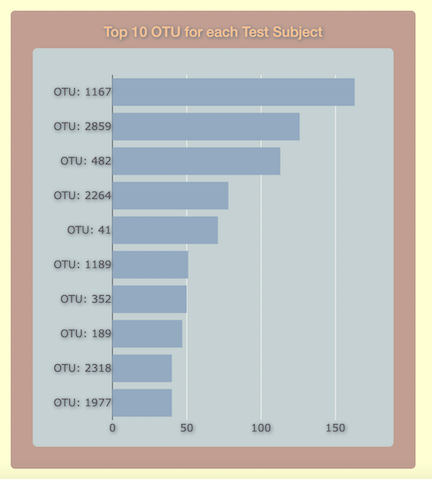
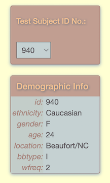

# bb-biodiversity

[Visit the deployed dashboard](https://tylerhill122.github.io/bb-biodiversity/)!

# Bellybutton Biodiversity Dashboard

The purpose of this repository is to build an interactive dashboard to explore the [Belly Button Biodiversity dataset](http://robdunnlab.com/projects/belly-button-biodiversity/), which catalogs the microbes that colonize human navels.

The dataset reveals that a small handful of microbial species (also called operational taxonomic units, or OTUs, in the study) were present in more than 70% of people, while the rest were relatively rare.

## Methods

1. Use D3.js library to read in samples.json file
2. Create a horizontal bar chart with a dropdown menu to display the top 10 OTUs found in each individual.

3. Create a bubble chart to display each OTU and their representation.

4. Display the sample metadata, i.e., an individual's demographic information.

5. Display each key-value pair from the metadata JSON object somewhere on the page.

6. Update all the plots when a new sample is selected.

7. Deploy your app to a free static page hosting service, such as GitHub Pages.

## Advanced Challenge Assignment (Optional)

* Adapt the Gauge Chart from <https://plot.ly/javascript/gauge-charts/> to plot the weekly washing frequency of the individual.

* You will need to modify the example gauge code to account for values ranging from 0 through 9.

* Update the chart whenever a new sample is selected.
